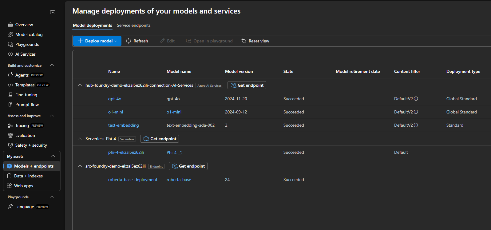
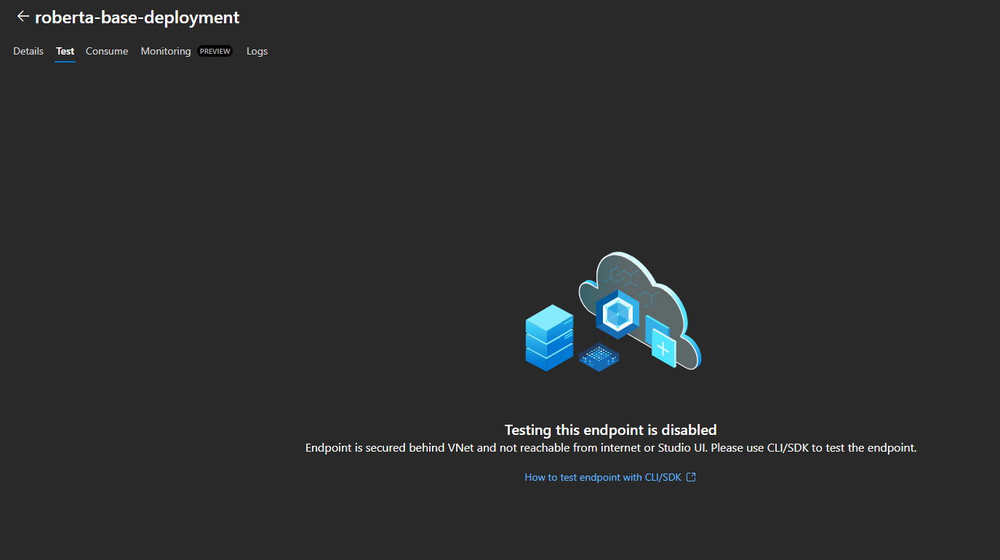

###  **Validating the Managed Online Endpoint**

As part of this project, the **`roberta-base`** model from **Hugging Face** is deployed. This is a pre-trained language model optimized for the **fill-mask** task within the Transformers library. The model was selected in alignment with the **Azure AI Foundry** tutorial:  
🔗 [How to deploy and inference a managed compute deployment with code](https://learn.microsoft.com/en-us/azure/ai-foundry/how-to/deploy-models-managed)  

The model is deployed under the **Endpoint** section:  

  

---

###  **Traffic Configuration Validation**  

Verify that the online endpoint routes **100% of the traffic** to the deployed model. If the traffic is distributed differently, update the configuration to ensure all inference requests are directed to the intended model:  

  

---

###  **Model Testing and Verification**  

Since the endpoint is secured behind a **VNet**, it cannot be tested directly from the Azure AI Foundry portal.  

  

To validate the deployment, connect to the **VPN** and run the Python test script:  
[**test/online-endpoint-test.py**](../test/online-endpoint-test.py)  

Executing this script will produce the following output:  

```bash
b'[{"score":0.8638191223144531,"token":812,"token_str":" capital","sequence":"Paris is the capital of France."},
{"score":0.055570363998413086,"token":1144,"token_str":" heart","sequence":"Paris is the heart of France."},
{"score":0.02755085751414299,"token":1867,"token_str":" Capital","sequence":"Paris is the Capital of France."},
{"score":0.015455810353159904,"token":1312,"token_str":" center","sequence":"Paris is the center of France."},
{"score":0.003802788909524679,"token":343,"token_str":" city","sequence":"Paris is the city of France."}]'
```


✅ This confirms that the model is successfully deployed and capable of performing accurate inferences through the **managed online endpoint**.
